# Тестирование Django-приложений
Ниже приведены пояснения к [вебинару](https://geekbrains.ru/events/1311) по тематике тестирования Django-приложений для портала [geekbrains.ru](https://geekbrains.ru), все необходимые ссылки и команды.  

## Youtube

[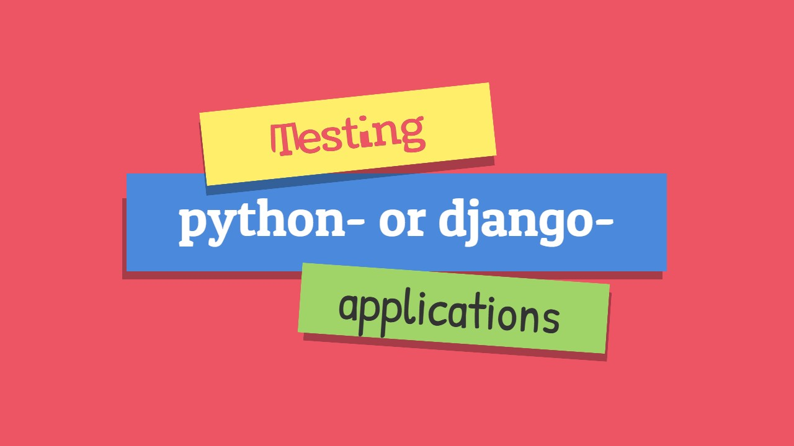](https://youtu.be/5gc5RaFCuwg "Тестирование Django-приложений")  

## Презентация
[Презентация к вебинару](./Webinar_Django_Testing.pdf)

## Подготовка проекта
В этом разделе описывается как подготовить окружение для всех последующих действий  

### Создаём вирутеально окружение
Для независимой работы от остальных проектов необходимо подготовить виртуально окружение для Python с помощью пакета `virtualenv`. Чтобы устновить данный пакет необходимо выполнить команду в терминале (подходит как для windows, так и для linux):  
```bash
pip install --no-cache-dir -U virtualenv
```  
Далее создаём корневую папку проекта, в которой расположаться папка виртуального окружения и самого проекта:  
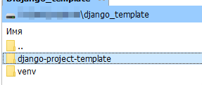  
Создаём вирутальное окружение командой:  
```bash
python -m virtualenv venv
```  
При работе с проектом не забывайте активировать виртуальное окружение с помощью команды:  
*  Для linux
```bash
source ./venv/bin/activate
```  
* Для windows
```cmd
.\venv\Scripts\activate
```  

### Клонируем проект
Для клонирования проекта достаточно выполнить следующую команду в терминале:  
```bash
git clone https://github.com/catexis/django-project-template.git
```  

### Предварительная настройка проекта
**Устанавливаем зависимости.** В папке непосредственно проекта выполняем команду установки зависимостей:  
```bash
pip install --no-cache-dir -r requirements.txt
```  
**Проводим миграции.** Для создания базы данных и таблиц в ней:  
```bash
python .\manage.py migrate
```  
**Создаём суперпользователя.** Для возможности зайти на сайт:  
```bash
python .\manage.py createsuperuser
```  

## Добавляем функцию запроса внешних данных в проект
Смотрим файл: `website\utils.py`. В нём следующий код:  
```python
import requests
import json

# URL as global variable
URL = "https://www.cbr-xml-daily.ru/daily_json.js"


def get_external_data():
    req = requests.get(URL)
    if req.status_code == 200:
        ret = json.loads(req.text)
    else:
        ret = None
    return ret
```  
Добавленная функция будет запрашивать внешние данные указанные в глобальной переменной `URL` через пакет `requests`.

## Отладка с помощью дебагеров

### Консольный
Консольный модуль отладки `pdb` включен в стандартную библиотеку и дополнительно его устанавливать не надо. Для его включение необходимо импортировать сам модуль и установить точку останова, например так:  
```python
import pdb
def get_external_data():
    req = requests.get(URL)
    if req.status_code == 200:
        ret = json.loads(req.text)
    else:
        ret = None
    pdb.set_trace()
    return ret
```  
При выполнении кода дебагер остановится на указанной точке. Обращаю внимание, что дабагер имеет свой синтаксис, о котором можно почитать [тут](https://docs.python.org/3/library/pdb.html#debugger-commands).

### Подключаем дебагер в VSCode
Для подключения дебагера в VSCode у вас должно быть установлено расширение для поддержки языка Python:  
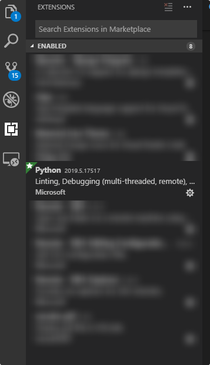  
Во вкладке дебагера выбираем шестерёнку и выбираем тип проектов к которому будем создавать конфигурации:  
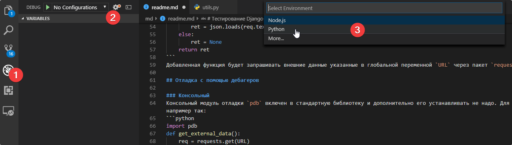  
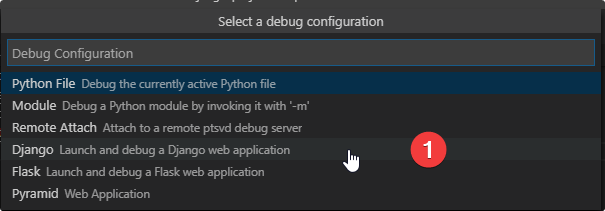  
При этом конфигурацию можно модифицировать следующим образом:  
```json
{
    "name": "Django",
    "type": "python",
    "request": "launch",
    "pythonPath": "<путь до корневой папки проекта>\\venv\\Scripts\\python",
    "program": "${workspaceFolder}\\manage.py",
    "args": [
        "runserver",
        "0.0.0.0:8000",
        "--noreload",
        "--nothreading"
    ],
    "django": true
}
```  
Где `<путь до корневой папки проекта>` замение на путь к той папке, которую создавали в самом начале. Если всё сделано правильно, то по нажатию кнопки `F5` запустится проект в режиме отладки. В консоли Вы увидете следующие строки:  
```bash
June 03, 2019 - 11:29:42
Django version 2.0.5, using settings 'website.settings'
Starting development server at http://0.0.0.0:8000/
Quit the server with CTRL-BREAK.
```  
Теперь вы можете установить точку остановки рядом с номер строки и в момент выполнения Вам станет доступна информацию о текущем окружении:  
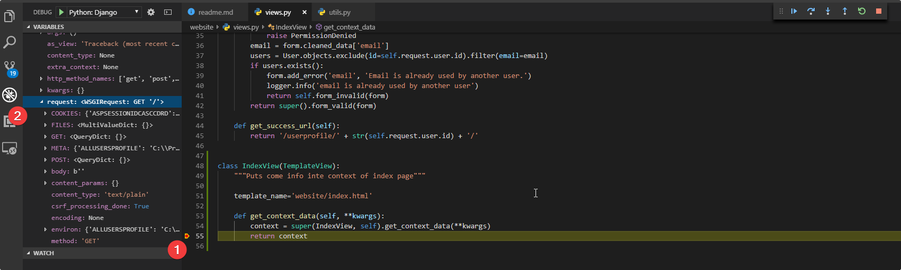  

### Подключаем дебагер в PyCharm
Открываем корневую папку проекта в PyCharm и проверяем, что программа корректно подхватила путь к интерпретатору  
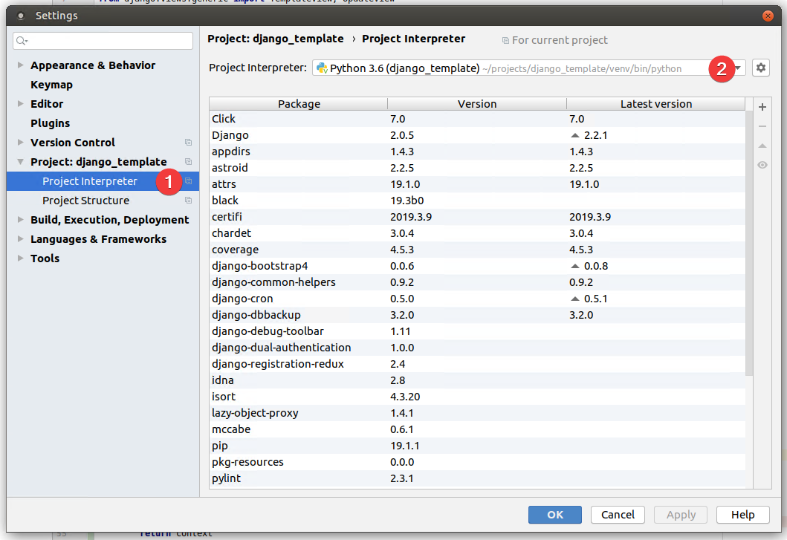  
После открытия проекта PyCharm проиндексирует Ваш проект и только после этого позволит добавлять конфигурации для дебагера. В верхнем правом углу находим кнопу добавлени конфигураций:  
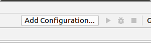  
В появившемся окне нажимем "плюс" и выбираем python:  
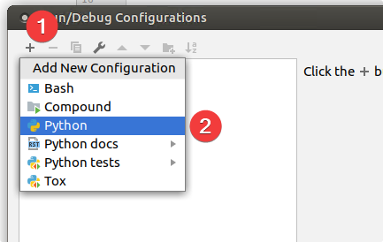  
Настраиваем конфигурацию:  
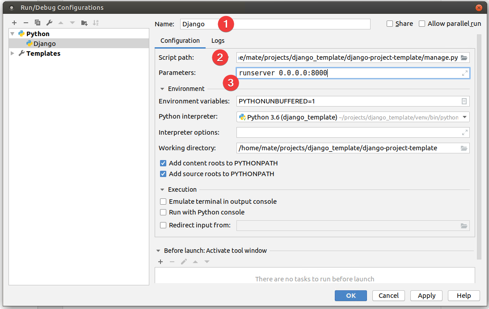  
Можно запускать программу в режиме отладки:  
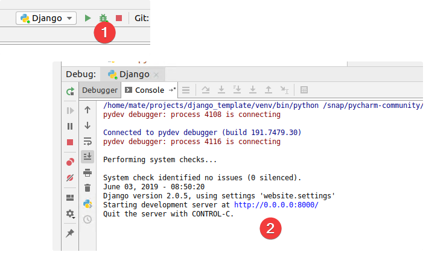  

### Консервируем объекты
Модуль `pickle` входит в стандартную библиотеку. Устанавилвать дополнительно ничего не требуется. Модифицируме код в файле `website\utils.py` следующим образом:  
```python
import requests
import json
import pickle

# URL as global variable
URL = "https://www.cbr-xml-daily.ru/daily_json.js"


def get_external_data():
    req = requests.get(URL)
    if req.status_code == 200:
        ret = json.loads(req.text)
        with open("debug_obj.dbg", "wb") as outf:
            pickle.dump(req, outf)
    else:
        ret = None
    return ret

if __name__ == "__main__":
    # Run first as call function for object save
    get_external_data()
    # Comment line with func call to work with saved object
    # with open("debug_obj.dbg", "wb") as inpf:
    #     old_obj = pickle.load(inpf)
    # print(old_obj.text)
```  
Теперь при запуске из командной строки с помощью команды:  
```bash
python website\utils.py
```  
Выполнится сохранение объекта. Чтобы работать с ним необходимо изменить последние строчки кода следующим образом:  
```python
# Run first as call function for object save
# get_external_data()
# Comment line with func call to work with saved object
with open("debug_obj.dbg", "wb") as inpf:
    old_obj = pickle.load(inpf)
print(old_obj.text)
```  
Теперь внешний запрос, который мы выполняли ранее находится в объекте `old_obj`

## Тестирование проекта
### Проверка покрытия кода тестами
Можно провести проверку покрытия кода с помощью модуля `coverage`. [Ссылка на документацию](https://coverage.readthedocs.io/en/v4.5.x/). Сам модуль выполняет тесты и смотрит какие части программы ими покрыто. Это внешний модуль и его необходимо установить:  
```bash
pip install --no-cache-dir -U coverage
```
Теперь можно выполнить анализ проекта
```bash
coverage run --source='.' manage.py test website.tests
```  
После анализа можно посмотреть результат через консоль выполнив соответствующую команду  
```bash
coverage report -m
```  
В терминале появится вывод
```bash
Name                            Stmts   Miss  Cover   Missing
-------------------------------------------------------------
create_local_settings.py           33     33     0%   3-47
exampleapp\__init__.py              0      0   100%
exampleapp\admin.py                 1      0   100%
exampleapp\models.py                1      0   100%
exampleapp\tests.py                 6      6     0%   1-11
exampleapp\views.py                 1      1     0%   1
manage.py                          13      6    54%   9-21
website\__init__.py                 1      0   100%
website\context_processors.py       3      0   100%
website\settings.py                21      0   100%
website\tests.py                   20      0   100%
website\unittest.py                 0      0   100%
website\urls.py                     8      0   100%
website\utils.py                   14     14     0%   1-21
website\views.py                   39     18    54%   17-19, 29-31, 34-42, 45, 54-55
-------------------------------------------------------------
TOTAL                             161     78    52%
```  
Либо сформировать html отчёт командой  
```bash
coverage html
```  
После выполнения появится папка `htmlcov`, в которой открыв файл `htmlcov\index.html` можно увидеть подробный отчёт о покрытии программы тестами.

### Unit тестирование
Модуль для тестирования `unittest` входит в стандартную библиотеку. В файле `website\unittest.py` приведён пример тестирования функции на тип возвращаемого значения. Для запуска теста необходимо выполнить команду:  
```bash
python -m unittest website\unittest.py
```
При этом в консоль выведится следующий текст:  
```bash
.
----------------------------------------------------------------------
Ran 1 test in 0.236s

OK
```
Где `.` означает количество тестов, которое было проведено. `OK` означает, что все тесты завершились успешно.  

### Django тесты
В рассматриваемом проекте уже подготовлены тесты для проверки того, что заход пользователя на сайт происходит корректно. Тесты находятся в файле `website\tests.py`. Для их запуска необходимо выполнить команду:  
```bash
python .\manage.py test website.tests
```  
Во времы выполнения тестов создаётся новая база данных, которая некоим образом не связана с Вашей основной. Для её создания выполняются все доступные миграции и база фактически пустая. Поэтому если Вы проверяете выборку из базы, то необходимо предварительно наполнить базу в методе `setUp`.  

### Selenium
Это сторонняя библиотека, которая создана для упрощения проведения тестов пользовательского интерфейса. В рамках вебинара не хватило времени для её рассмотрения, но Вы всегда можете изучить её самостоятельно по [документации](https://selenium-python.readthedocs.io/).

## Качество кода
### Линтеры
Линтеры проверяют Ваш листинг файла и позволяют находить неточности на предмет общественных соглашений по коду (PEP). Например внешний пакет `pylint`. Устанавливается командой:  
```bash
pip install --no-cache-dir -U pylint
```
Далее можно проверить любой файл на предмет возможных нарушений соглашений командой:  
```bash
pylint website\utils.py
```
При этом в консоль выведется информация о проблемах:  
```bash
************* Module website.utils
website\utils.py:1:0: C0111: Missing module docstring (missing-docstring)
website\utils.py:9:0: C0111: Missing function docstring (missing-docstring)
website\utils.py:2:0: C0411: standard import "import json" should be placed before "import requests" (wrong-import-order)
website\utils.py:3:0: C0411: standard import "import pickle" should be placed before "import requests" (wrong-import-order)

-----------------------------------
Your code has been rated at 7.14/10
```  

### Форматеры
В рамках вебинара мы просматрели два форматера: `black`, `isort`. Первый выполняем форматирование кода, второй выполняет форматирование строк с включением сторонних модулей\библиотек. Установка пакетов:  
```bash
pip install --no-cache-dir -U black isort
```  
Проходимся по файлу с помощью `isort`. Было:  
```python
import requests
import json
import pickle
```  
Запускаем выполнение командой:  
```bash
isort website\utils.py
```
Стало:  
```python
import json
import pickle

import requests
```  
Форматер `black` может запускаться с флагом `-l` который указывает примелимую для Вас длину строки (в соответсвии с PEP8 это 80 символов, но в рамках команды разработки это значение может меняться).
Было:  
```python
def get_external_data():
    req=requests.get(
                     URL
    )
    if req.status_code == 200:
        ret=json.loads(  req.text  )
        with open( 'debug_obj.dbg' , "wb") as outf:
            pickle.dump(
                    req,
                    outf
            )
    else:
        ret=dict()
    return ret
```
Запускаем командой: 
```bash
black -l 120 website\utils.py
```  
Стало:  
```python
def get_external_data():
    req = requests.get(URL)
    if req.status_code == 200:
        ret = json.loads(req.text)
        with open("debug_obj.dbg", "wb") as outf:
            pickle.dump(req, outf)
    else:
        ret = dict()
    return ret
```